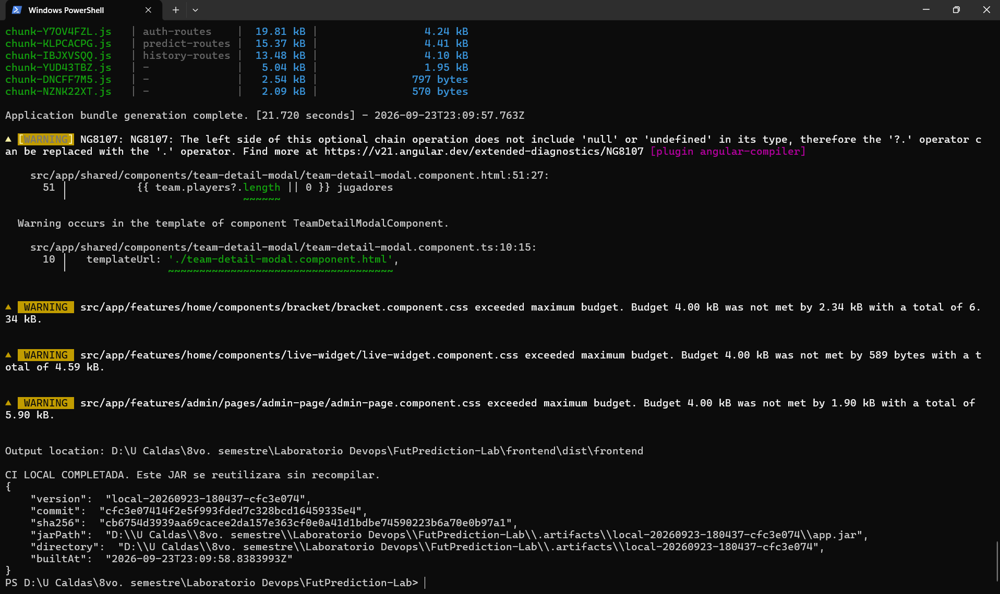
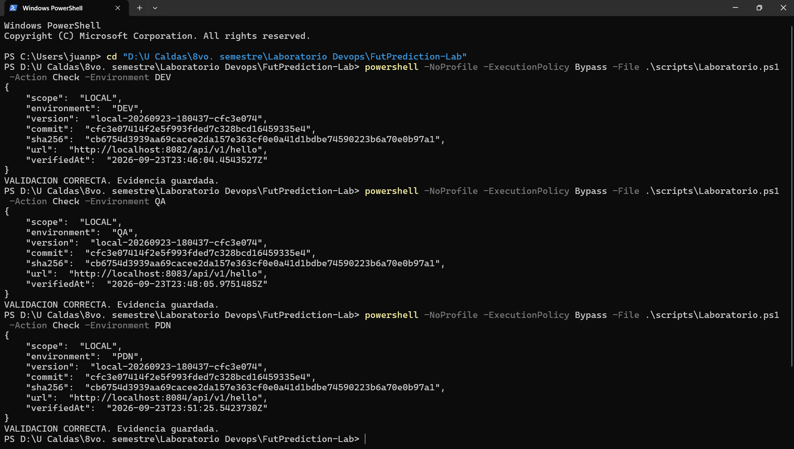
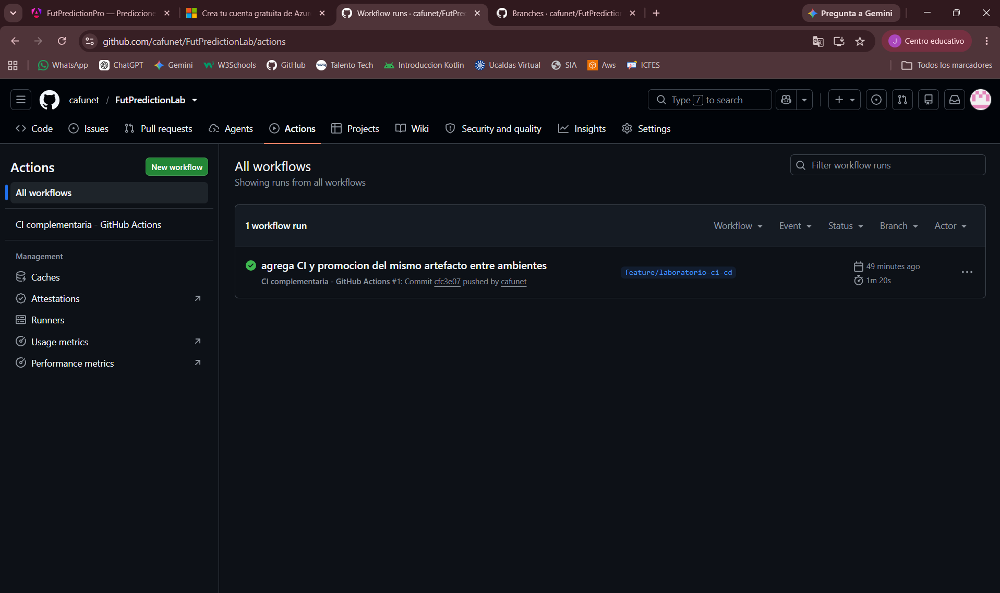

# Laboratorio DevOps - FutPrediction

**Ruta:** Java / Spring Boot. **Repositorio:** https://github.com/cafunet/FutPredictionLab

**Integrantes:** completar con los nombres del equipo.

## Alcance y limitacion

Se adapto un proyecto academico existente para aplicar pruebas automatizadas,
artefactos versionados, variables por ambiente y promocion de una misma version.
La aplicacion usa Java 17/Spring Boot, Angular y PostgreSQL. Docker facilita su
ejecucion local. El servicio LLM del proyecto original no se incluye en el laboratorio.

El acceso a Azure no pudo completarse: la validacion de la cuenta fallo y las
cuentas alternativas consultadas no mostraron un directorio utilizable. Por ello
no se presentan como completados un pipeline Azure, despliegues Azure ni una
aprobacion de produccion en Azure DevOps. Se prepara el YAML requerido y una
demostracion local complementaria. GitHub Actions se identifica como otra plataforma.

## Trabajo comprobado antes de esta ampliacion

- Aplicacion local operativa: registro de usuario, administracion de equipos y partidos.
- Esquema PostgreSQL exportado y restaurado: ocho tablas comprobadas.
- 20 pruebas Java y 13 pruebas Angular aprobadas; JAR generado con BUILD SUCCESS.
- API-Sports movida al backend; consulta real respondio HTTP 200.
- Repositorio propio con ramas main y develop publicadas; rama feature creada.

## Automatización local ejecutada y validada

El endpoint `/api/v1/hello` expone mensaje, ambiente, version y commit. El ambiente
se inyecta al ejecutar el proceso. La version y el commit se incorporan al JAR con
Spring Boot Build Info durante CI; no se sustituyen en cada despliegue.

El build comprueba pruebas y compilacion, guarda `app.jar` y genera un manifiesto
con SHA-256. Los ambientes DEV, QA y PDN reciben el mismo archivo. La verificacion
local compara la respuesta HTTP y el hash calculado dentro de cada contenedor.
QA exige DEV validado; PDN exige QA validado y una confirmacion explicita local.

| Evidencia | Estado verificado |
| --- | --- |
| 24 pruebas Java y 13 Angular | Aprobadas en el build local; JAR y compilación Angular generados |
| CI complementaria GitHub | Ejecución número 1 correcta para cfc3e07 en feature/laboratorio-ci-cd; captura adjunta |
| DEV local, puerto 8082 | Validado el 23/09/2026 a las 18:46:04 UTC−05 |
| QA local, puerto 8083 | Validado el 23/09/2026 a las 18:48:05 UTC−05 |
| PDN local, puerto 8084 | Validado el 23/09/2026 a las 18:51:25 UTC−05 |
| Confirmación local de PDN | Registrada en approval-local.json; no equivale a Azure Approvals |
| PR feature -> develop -> main | Pendiente; registrar URLs |
| YAML Azure | Preparado; pendiente de ejecutar en Azure |
| Despliegues y aprobacion Azure | Pendientes por falta de acceso |

Las evidencias locales se incluyen en `docs/evidencias/local`. Los Pull Requests
siguen pendientes de integración. La captura de GitHub Actions confirma la ejecución número 1 correcta (1 min 20 s). El enlace disponible es https://github.com/cafunet/FutPredictionLab/actions; falta registrar el enlace específico de la ejecución.
El detalle de ejecución está en `LABORATORIO.md`.

## Trazabilidad del artefacto validado

- Versión: `local-20260923-180437-cfc3e074`.
- Commit del código construido: `cfc3e07414f2e5f993fded7c328bcd16459335e4`.
- Artefacto: `app.jar`.
- SHA-256: `cb6754d3939aa69cacee2da157e363cf0e0a41d1bdbe74590223b6a70e0b97a1`.

Los registros DEV.json, QA.json y PDN.json contienen exactamente esos mismos
valores. El verificador calculó el hash dentro de cada contenedor, además de
comprobar la respuesta de `/api/v1/hello`. La configuración del ambiente cambió;
el archivo ejecutable se conservó sin recompilar.

La confirmación de PDN fue realizada localmente por el usuario `juanp` y quedó
registrada antes de la validación de PDN. Es una confirmación del operador; no se
presenta como aprobación independiente ni como control de Azure DevOps.

La CI de GitHub genera otro build con su propio
identificador y hash. No se afirma que ese artefacto sea el utilizado en esta
demostración local.

## Preguntas de reflexión

### 1. Diferencia entre CI y CD

CI integra los cambios y ejecuta comprobaciones automaticas, como compilacion y
pruebas. La entrega continua prepara una version desplegable; el despliegue continuo
la publica automaticamente. Una aprobacion manual antes de PDN corresponde a un
flujo de entrega con control humano sobre el despliegue.

### 2. Por que construir una vez

Permite desplegar en produccion exactamente el binario validado previamente.
El identificador de version, el commit y el hash hacen verificable esa continuidad.

### 3. Problema de recompilar por ambiente

Pueden cambiar dependencias, herramientas o archivos generados. Aunque el codigo
parezca igual, el binario resultante podria ser distinto al que supero QA.

### 4. Variables y secretos

El nombre del ambiente, las URLs y los nombres de recursos son configuracion.
Las contrasenas, JWT_SECRET y API_SPORTS_KEY son secretos. Se mantienen fuera de
Git y del YAML; localmente estan en `.env` y en Azure deben estar en variables
secretas o en un almacen de secretos autorizado.

### 5. Controles adicionales en PDN

Los errores en produccion afectan a los usuarios. La aprobacion permite revisar
la version, las pruebas y el resultado de QA antes de autorizar el despliegue.
Una aprobacion independiente ofrece mas control que una confirmacion propia.

### 6. Que ocurre si una prueba falla

CI debe detenerse y no publicar un artefacto promovible. Los despliegues dependientes
de CI no deben continuar. Los informes de pruebas permiten encontrar el fallo.

### 7. Relacion entre commit y version

El build inserta el SHA del commit en el JAR y publica un manifiesto con version y
hash. El endpoint de cada ambiente devuelve el commit y la version; los registros
de la ejecucion y los PR completan la trazabilidad del cambio.

### 8. Jenkins frente a una plataforma administrada

Jenkins ofrece flexibilidad y control de la infraestructura, pero requiere operar,
actualizar y proteger el servidor y sus plugins. Una plataforma administrada reduce
esa administracion y facilita la integracion de repositorios y aprobaciones, a
cambio de depender de su disponibilidad, permisos, limites y modelo de costos.

## Riesgos y trabajo pendiente

La instalacion npm reporto 44 vulnerabilidades, incluida una critica; no se ha
completado su analisis ni remediacion. Las pruebas unitarias no prueban ausencia
de vulnerabilidades. La demo local no representa infraestructura productiva ni
reemplaza los requisitos de evidencia de la guia en Azure.
